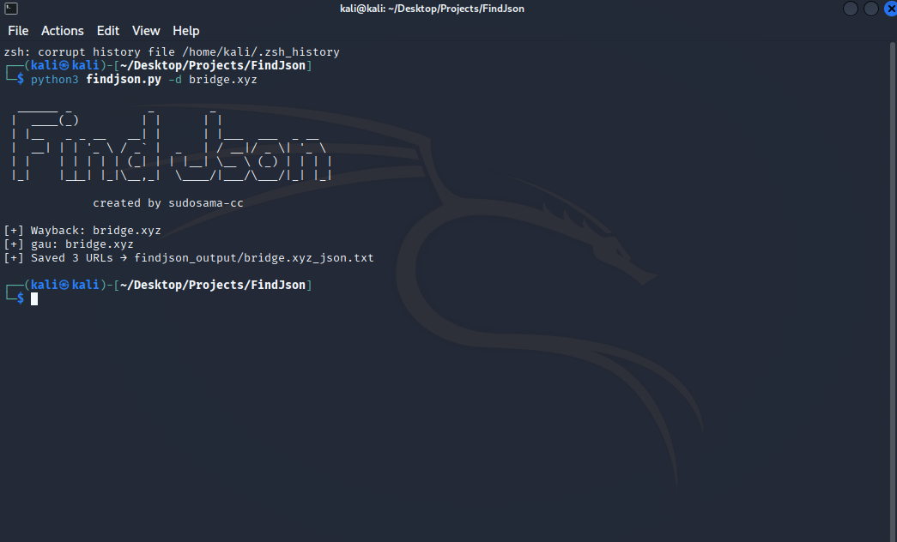

### 6. Installation of requirements.txt
```bash
pip3 install -r requirements.txt
```
### Usage of FindJson

#### findjson
```bash
python3 findjson.py -d https://target.com
-
python3 findjson.py -list targets.txt
```
Finds saves the target site's json endpoints.

### Example Usage


